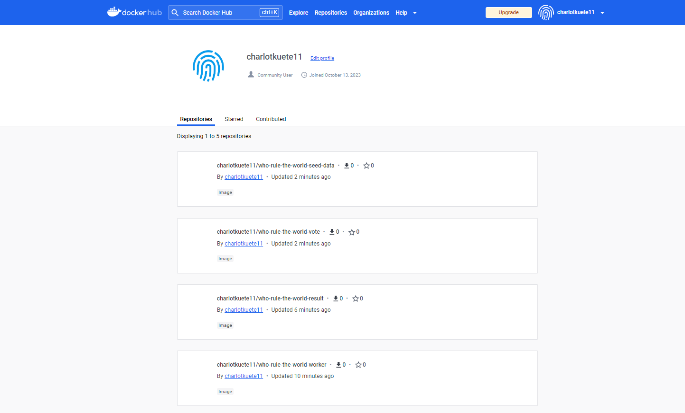

# WHO RULE THE WORLD ? CATs  or DOGs  ?

## SOMMAIRE

1. [Membres du groupe](#membres-du-groupe)
2. [Etapes du projet](#etapes-du-projet)
3. [Affichage des images](#docker-images)
4. [Inspection des networks](#inspection-des-networks)
5. [Images sur docker hub](#images-sur-docker-hub)
5. [Répertoire privé](#répertoire-privé)
5. [Liste des containers](#liste-des-containers)

## Membres du groupe

1. KUETE Charlot Junior
2. MBABOU Romario Ulrich
3. CHEONG David

### Etapes du projet

1. Création des fichiers Dockerfile docker-compose.build.yml et compose.yml.
Lancement du build en récupérant les images

2. Création des Networks "front-tier" et "back-tier".

3. Création du registry

4. Création des conteneurs

### Docker images
Affichage des images

### Inspection des networks
1. Inspection du network back-tier

2. Inspection du network front-tier

### Images sur docker hub

### Répertoire privé

Images dans notre répertoire privé.

### Liste des containers

Affichage des containers qui tournent.

